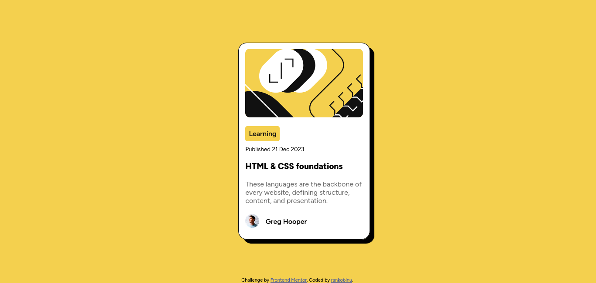

# Frontend Mentor - Blog preview card solution

This is a solution to the [Blog preview card challenge on Frontend Mentor](https://www.frontendmentor.io/challenges/blog-preview-card-ckPaj01IcS). Frontend Mentor challenges help you improve your coding skills by building realistic projects. 

## Table of contents

- [Overview](#overview)
  - [The challenge](#the-challenge)
  - [Screenshot](#screenshot)
  - [Links](#links)
- [My process](#my-process)
  - [Built with](#built-with)
  - [What I learned](#what-i-learned)
  - [Continued development](#continued-development)
- [Author](#author)

## Overview
This is my second Chalenge on Frontend Mentor, the challenge is to make a page of a preview card 
### The challenge

Users should be able to:

- See hover and focus states for all interactive elements on the page

### Screenshot
The design

My soulution 

### Links

- Solution URL:(https://github.com/rankobinu/bloc_preview_card)
- Live Site URL:(https://rankobinu.github.io/bloc_preview_card/)
## My Process

### Built with

- Semantic HTML5 markup
- CSS custom properties
- Flexbox
- CSS Grid

### Continued development

I want to focus in css html languages and get to use to them 

## Author

- Frontend Mentor - [@rankobinu](https://www.frontendmentor.io/profile/rankobinu)

